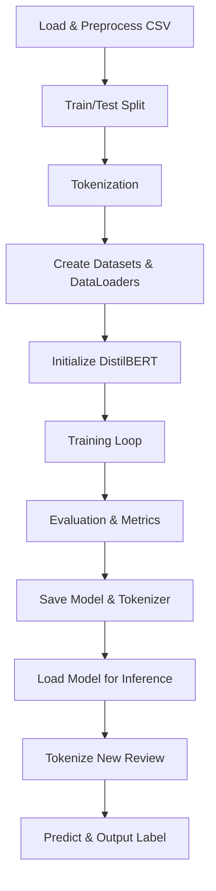

**Project: DistilBERT Review Classifier**

## Table of Contents

1. [Overview](#overview)
2. [Motivation](#motivation)
3. [Installation](#installation)
4. [Usage](#usage)
5. [Why DistilBERT?](#why-distilbert)
6. [Alternative Approaches](#alternative-approaches)
7. [Process Flowchart](#process-flowchart)
8. [Potential Improvements](#potential-improvements)
9. [License](#license)

---

## Overview

This project trains and deploys a DistilBERT-based binary classifier to determine whether a product review is **AI-generated** or **human-written**. It includes two key scripts:

- **train.py**: Preprocesses data, fine-tunes DistilBERT on labeled reviews, evaluates performance, and saves the trained model & tokenizer.
- **predict.py**: Loads the saved model and tokenizer, processes a single review (with optional rating), and outputs a classification.

The classifier achieves high accuracy, generates detailed training logs, and produces confusion matrix visualizations.

---

## Motivation

- **Efficient inference**: DistilBERT offers a compact, fast alternative to BERT with competitive accuracy and reduced latency, ideal for real-time prediction in production environments.
- **Data-driven insights**: Distinguishing AI-generated text from human-written reviews helps platforms maintain trust, detect spam or fake feedback, and ensure authentic user experiences.

---

## Installation

1. Clone the repository:
   ```bash
   git clone https://github.com/yourusername/distilbert-review-classifier.git
   cd distilbert-review-classifier
   ```
2. (Optional) Create and activate a virtual environment:
   ```bash
   python -m venv venv
   source venv/bin/activate   # Linux/Mac
   venv\\Scripts\\activate  # Windows
   ```
3. Install dependencies:
   ```bash
   pip install -r requirements.txt
   ```
4. Prepare your dataset in CSV form with columns `review`, `rating`, and `isAI` (0 or 1).

---

## Usage

### Training

```bash
python train.py \
  --data_file PATH/TO/your_data.csv \
  --model_dir PATH/TO/save/model \
  --epochs 3 \
  --batch_size 16 \
  --max_length 256
```

- Outputs:
  - `model_dir/config.json`, `pytorch_model.bin`, `tokenizer_*`
  - `confusion_matrix.png`, printed metrics to console and a text report.

### Inference

```bash
python predict.py \
  --model_dir PATH/TO/save/model \
  --text "This product is amazing!" \
  --rating 5 \
  --max_length 256
```

- Outputs classification: **Human-written** or **AI-generated**.

---

## Why DistilBERT?

- **Speed & Size**: DistilBERT is \~40% smaller and 60% faster than BERT with only \~4% drop in performance for many tasks.
- **Fine-tuning friendly**: Easily adapts to downstream classification tasks with minimal hyperparameter tuning.
- **Community support**: Part of Hugging Face Transformers, leveraging standardized APIs and pretrained weights.

---

## Alternative Approaches

- **Full BERT**: Higher accuracy potential but slower and larger footprint.
- **RoBERTa**: Improved training methodology; more robust but heavier than DistilBERT.
- **Lightweight models**: SpaCy text classifiers or FastText require less compute but may underperform on nuanced AI vs. human style detection.
- **Classical ML**: TF-IDF + Logistic Regression/SVM offers interpretability but limited capability on subtle linguistic patterns.

---

## Process Flowchart



---

## Potential Improvements

- **Mixed precision training**: Leverage `torch.cuda.amp` to speed training and reduce memory.
- **Checkpointing & Early Stopping**: Save intermediate best models and stop training when validation loss plateaus to prevent overfitting.
- **Hyperparameter Optimization**: Automate search (e.g., using Optuna) for learning rate, batch size, and number of epochs.
- **Data augmentation**: Introduce paraphrasing or back-translation to diversify training examples.
- **Multi-class labels**: Extend beyond binary to detect styles (e.g., marketing-speak, spam, positive/negative sentiment).
- **Model distillation**: Further compress the model by distilling into an even smaller student model.

---

## License

This project is released under the MIT License.

